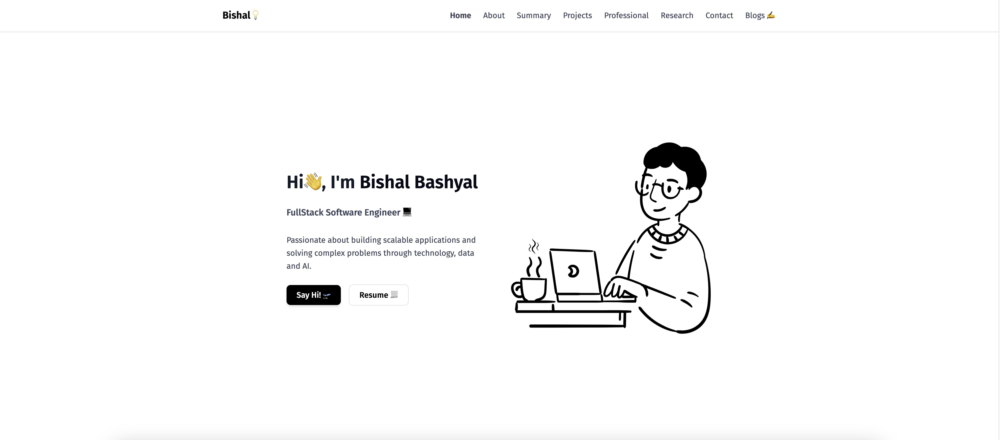
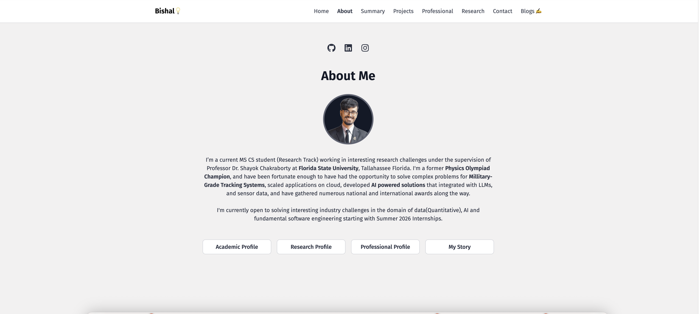

# 🌐 Hi Good People


Welcome to the repository for my good old notion-color palette personal website!  
This site showcases my projects, skills, and experience and writeups in AI, Data and Softwares. I am also planning to update some summaries of my research works via blogs soon(once my time allows).



## 🚀 Live Demo
Check out the live version here: [**Bishal B**](https://bishalb.com)

---

## 📜 About
This portfolio is designed to:
- Highlight my **technical skills** and **projects**.
- Provide an easy way to **contact me** for opportunities.
- Serve as a central hub for my professional online presence.

---

## 🛠️ Tech Stack
- **Frontend:** HTML, CSS, JavaScript (React with Vite)
- **Styling:** Tailwind CSS / Bootstrap
- **Backend:** This is a static website
- **Deployment:** Vercel

---

## 📂 Features
- 🎯 **Responsive Design** – Works on desktop, tablet, and mobile.
- 📂 **Projects Showcase** – Detailed case studies with links.(Some still need to be Updated) 
- 📄 **Resume Download** – Easy access to my CV.
- 📬 **Contact Form** – Direct email integration with FormSpree
- 📬 **Blogs** – Manage blogs directly by writing on notion and exporting to the blogs folder in the working directory/ no backend required.

## 📷 Preview



## 📦 Installation & Setup
If you'd like to run this locally:

```bash
# Clone the repository
git clone https://github.com/your-username/portfolio.git

# Navigate into the directory
cd portfolio

# Install dependencies
npm install

# Start the development server
npm run dev

```

If you loved this portfolio template and plan on using it for your personal website, do leave a star and an attribution on your github fork 🖤.
