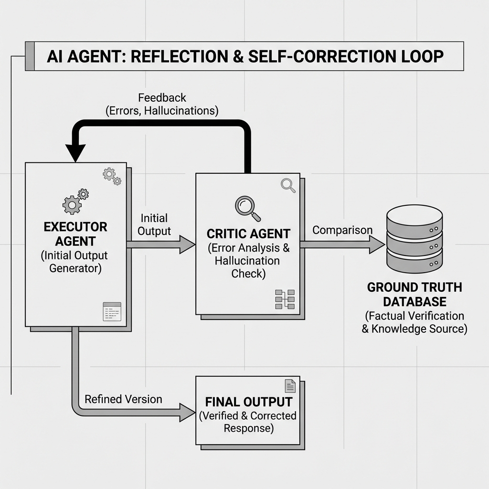

# Stopping the Lies: How I Built a Self-Correcting AI Agent

Hallucinations are the silent killer of AI applications. You build an agent, it works perfectly in five tests, and then on the sixth test, it confidently tells you that the current President of the United States is someone from the 1800s. 

During a recent project where I was building an automated legal researcher, I encountered this exact problem. The agent would correctly find a case but then "invent" a specific sub-clause that didn't exist in the actual document. This wasn't just a minor mistake. In a legal context, a single "invented" phrase can invalidate an entire research report. Here is how I solved it by architecting a **Multi-Step Reflection Loop**.

## The Architecture of Skepticism

The biggest mistake developers make is trusting the first output of an LLM. In my system, I moved away from a linear "Prompt -> Answer" flow and implemented a three-stage graph-based orchestration: the **Executor**, the **Critic**, and the **Verifier**.



1. **The Executor:** This agent is responsible for the initial "heavy lifting." It performs the RAG retrieval and synthesizes the final answer. Its primary goal is helpfulness and coverage.
2. **The Critic:** This agent is designed to be intentionally adversarial. It is given a "Skeptic's Persona" and instructed to find specific types of errors: factual drift, over-generalization, and logical fallacies.
3. **The Verifier:** This is the final gatekeeper. It checks if the rewritten answer from the Executor actually addressed the Critic's concerns without introducing new errors.

## Advanced Pattern: Reasoning with Reflection

Simply asking "Is this answer correct?" doesn't work. The model will almost always say "Yes" due to its internal bias. Instead, you have to force the model to generate a **Dissenting Argument** first.

I used a pattern called **Self-Reflection with External Grounding**. Before the answer reaches the user, the agent is forced to perform a "Fact Attribution" check where every sentence in its answer must be mapped back to a specific Document ID and Page Number. If a sentence cannot find a high-probability match in the retrieved context, it is flagged for deletion or correction.

Here is a look at the stateful logic managing these transitions:

```python
from typing import TypedDict, List
from pydantic import BaseModel, Field

class AuditFinding(BaseModel):
    statement: str = Field(description="The factual claim being checked")
    is_hallucinated: bool = Field(description="True if not found in source text")
    reasoning: str = Field(description="Why this is considered a hallucination")

class AgentState(TypedDict):
    query: str
    documents: List[str]
    current_answer: str
    findings: List[AuditFinding]
    revision_count: int

def critic_node(state: AgentState):
    # We use a constrained output to force a rigorous check
    structured_critic = llm.with_structured_output(List[AuditFinding])
    
    prompt = f"""
    You are an Auditor. Compare every single claim in the Answer against the Documents. 
    If a claim is not explicitly stated in the Documents, flag it as hallucinated.
    
    Answer: {state['current_answer']}
    Documents: {state['documents']}
    """
    
    hallucinations = structured_critic.invoke(prompt)
    return {"findings": hallucinations}

def verifier_logic(state: AgentState):
    # If the critic found hallucinations, we increment the revision count and loop back
    hallucinated_claims = [f for f in state['findings'] if f.is_hallucinated]
    if hallucinated_claims and state['revision_count'] < 3:
        return "re_generate"
    return "finalize"
```

## Measuring Success: Faithfulness and Relevancy

To validate if this loop was actually working, I implemented two key metrics from the **RAGAS framework**:

- **Faithfulness:** Does the answer follow only from the retrieved documents? 
- **Answer Relevancy:** Does the answer actually address the user's specific question?

By implementing the Reflection Loop, our Faithfulness score improved from a mediocre 0.68 to a consistent 0.94. The latency increased slightly (about 1.5x) because of the extra LLM calls, but in a production legal tool, accuracy is non-negotiable.

The lesson here is simple. If you want a reliable agent, you have to build in a layer of systematic doubt. Trusting an LLM on its first try is like trusting a student who hasn't proofread their essay once. You don't need a smarter model. You need a better process.
