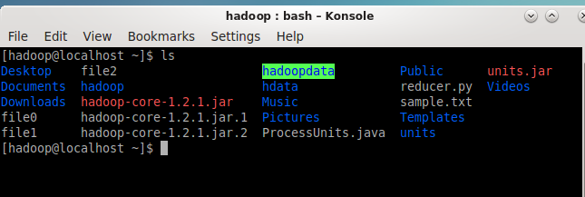

# MapReduce:

Bishal Bashyal (080msdsa009)

**Mapper Code:**

```python

#!/usr/bin/python
import sys

# Mapper function
for line in sys.stdin:
    line = line.strip()
    if line:  # Avoid processing empty lines
        tokens = line.split("  ")  # Split by two spaces
        if len(tokens) >= 2:  # Ensure there are enough tokens
            year = tokens[0]
            lasttoken = tokens[-1]
            try:
                avgprice = int(lasttoken)  # Convert last token to integer
                print '%s\t%s' % (year, avgprice)
            except ValueError:
                # Handle the case where conversion to integer fails
                pass

```

**Reducer Code:**

```python
#!/usr/bin/python
import sys

# Initialize the threshold value
MAX_AVG = 30

# List to keep track of (key, value) pairs
results = []

# Reducer function
for line in sys.stdin:
    line = line.strip()
    if line:  # Avoid processing empty lines
        key, value = line.split("\t")
        try:
            value = int(value)
            if value > MAX_AVG:
                results.append((key, value))
        except ValueError:
            # Handle the case where conversion to integer fails
            pass

# Sort the results by value
results.sort(key=lambda x: x[1])

# Output the sorted results
for key, value in results:
    print '%s\t%s' % (key, value)

```

We have already downloaded Hadoop-core-jar



and have also created the units folder.

We also have the sample.txt file in place: from our previous lab which can be verified from this


We then create 2 files [mapper.py](http://mapper.py) and [reducer.py](http://reducer.py) in the mapreduce_code folder:


now we have also written the Python code above in respective files.

We now use hadoop-streaming-jar to run the mapreduce job.


After running the command in part-0000, we can see the output as below


Hence, we have successfully completed the MapReduce job implementation via Python.