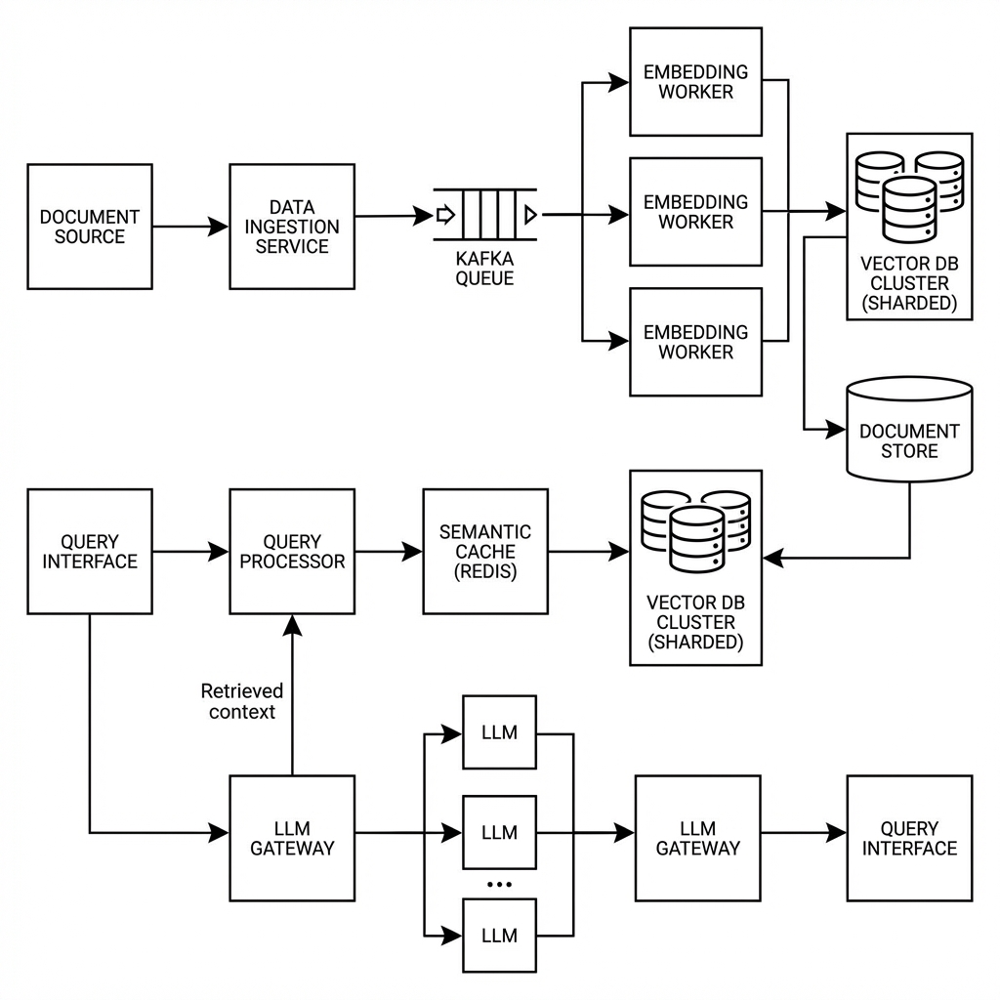

# Beyond the Prototype: Engineering Distributed RAG Pipelines at Scale

Everyone can build a RAG system in a Jupyter notebook. But moving that system into a production environment where it needs to process millions of documents and serve thousands of concurrent users is a completely different beast. 

I recently consulted for a company that needed to index their entire internal documentation set across forty global offices. Their initial "tutorial-based" setup was crashing every time they tried to ingest more than a thousand files at once. We had to throw out the simple Python scripts and build a **Distributed Event-Driven Architecture**.

## The Architecture of a Global Knowledge Base

In a production environment, you need to decouple your components. You cannot have a web server waiting for a PDF to be chunked, embedded, and indexed. We introduced **Kafka** as a message broker between our document sources (S3, Google Drive, SharePoint) and our processing workers.



1. **The Ingestion Service:** A lightweight service that watches for file changes and pushes the metadata onto a "Raw-Docs" Kafka topic.
2. **Horizontal Embedding Workers:** A cluster of workers that pull from the Kafka topic. Since embedding is a CPU/GPU intensive task, we can auto-scale these workers based on the length of the queue.
3. **The Vector DB Cluster:** We used **Qdrant** with a sharded architecture. Instead of one giant index, we partitioned the data by "Company Division" and "Access Level." This ensures that when an HR employee searches the docs, the system doesn't even bother looking at the Engineering partition, keeping the search latency low (under 100ms for p95).

## Solving the "Lost in the Middle" Problem

A common issue with RAG is that if you retrieve too many chunks, the LLM starts ignoring the middle sections of the context. To solve this, I implemented a **Two-Stage Retrieval Pipeline**:

- **Stage 1 (Coarse Search):** We use a Vector DB to retrieve the top 50 most semantically similar chunks. 
- **Stage 2 (Fine-Grained Reranking):** We pass those 50 chunks through a **Cross-Encoder model** (like BGE-Reranker). The Cross-Encoder is much slower than vector search but significantly more accurate at understanding the relationship between the question and the chunk. It re-scores the chunks and we only send the top 5 to the LLM.

## Technical Implementation: Semantic Caching with Redis

To handle high traffic without bankrupting the company on LLM costs, we implemented a **Semantic Cache**. Unlike a normal cache that looks for an exact string match, a semantic cache uses vector distance.

```python
import redis
from redis.commands.search.query import Query

def get_cached_answer(user_query_vector):
    # We search the Redis cache for any previous question that is 
    # semantically very close to the current one.
    query = (
        Query("*=>[KNN 1 @vector $vec AS score]")
        .sort_by("score")
        .return_fields("id", "answer", "score")
        .dialect(2)
    )
    
    results = redis_client.ft("idx:cache").search(query, {"vec": user_query_vector})
    
    # If we find a match with 0.98+ similarity, we serve the cached answer.
    if results.docs and float(results.docs[0].score) < 0.02:
        return results.docs[0].answer
    return None
```

## Resilience and Reliability

Production RAG isn't just about the "happy path." We had to implement:
- **Rate Limit Management:** Handling 429 errors from OpenAI with exponential backoff.
- **Dead Letter Queues (DLQ):** If a specific PDF consistently fails to be parsed, it moves to a DLQ for manual inspection instead of clogging up the pipeline.
- **Document Versioning:** When a document is updated on SharePoint, the system shouldn't just add a new version to the vector DB—it needs to prune the outdated embeddings to prevent the model from citing old information.

Scaling RAG is an engineering problem, not a modeling problem. It is about managing data flow, handling retries, and ensuring that your retrieval latency stays low even when the "knowledge base" grows from gigabytes into terabytes. 
