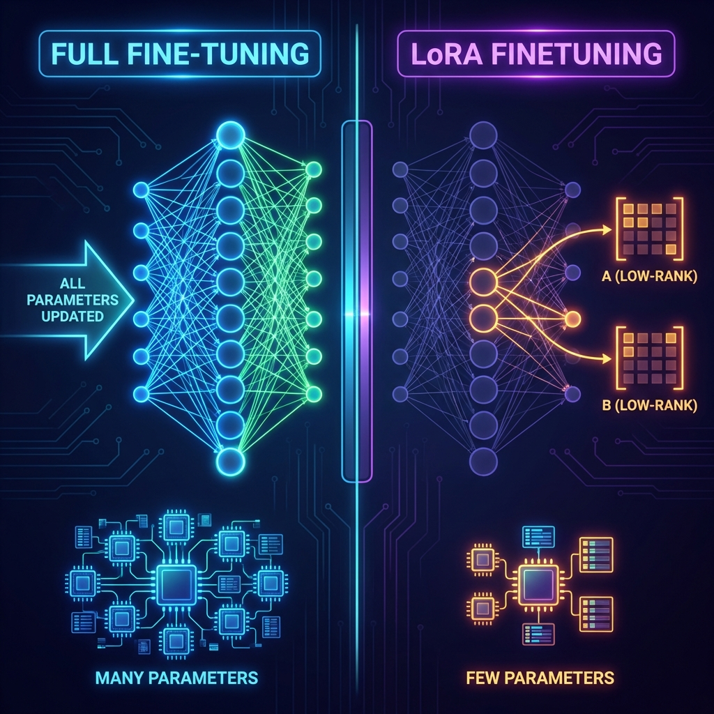

# LLM LoRA Fine-Tuning vs. Full Fine-Tuning: Which one to pick?

Hey there! If you've been playing around with Large Language Models (LLMs), you've probably hit that moment where the base model just doesn't quite "get" your specific domain. Whether it's medical jargon, legal speak, or just your unique brand voice, you need to fine-tune. But here comes the big question: **Do you go all-in with Full Fine-Tuning, or do you use LoRA?**

During my work on a specialized sentiment analysis model for financial news, I had to make this exact decision. Here is the technical breakdown of how these two methods actually differ.

## The Traditional Way: Full Fine-Tuning

Full fine-tuning is like taking a master chef and putting them back through culinary school specifically for Italian cuisine. You update **every single parameter** in the model. If you are tuning a Llama-3-70B model, you are updating 70 billion weights.

- **The Math:** During training, you have to store the weight gradients and optimizer states for every parameter. For a 70B model, this requires nearly 1.4 Terabytes of VRAM just for the optimizer states. This is why full fine-tuning is mostly reserved for massive organizations with H100 clusters.
- **The Good:** The model can learn extremely deep, fundamental changes in its reasoning.
- **The Risk: Catastrophic Forgetting.** Because you are modifying the base weights, the model might "forget" its general reasoning capabilities while trying to learn your niche data.

## The Smarter Way: LoRA (Low-Rank Adaptation)

LoRA is the "hack" that changed everything. Instead of changing the whole model, we freeze the original weights and add tiny, trainable "adapter" layers on the side. 



### The Low-Rank Secret

LoRA relies on a hypothesis called **Intrinsic Dimensionality**. It assumes that while a model might have billions of weights, the "delta" needed to learn a new task can be represented in a much lower dimension.

Mathematically, instead of learning a large weight matrix $W$, we learn two smaller matrices, $A$ and $B$, such that $W' = W + (B \times A)$. If $W$ is $4096 \times 4096$, it has 16 million parameters. If we use a Rank ($r$) of 8, then $A$ is $4096 \times 8$ and $B$ is $8 \times 4096$. Total parameters? Only 65,536. That is a **99.6% reduction** in trainable parameters.

## Advanced Implementation: QLoRA

In my project, I went a step further and used **QLoRA**. This involves quantizing the base model to 4-bit precision (using a special data type called NormalFloat4) and then running LoRA on top of it. This allowed me to fine-tune a Llama-3-8B model on a single consumer-grade A10 GPU, which was previously impossible.

Here is the configuration I typically use for a stable LoRA run:

```python
from peft import LoraConfig, get_peft_model, prepare_model_for_kbit_training
from transformers import BitsAndBytesConfig

# 1. 4-bit Quantization Config
bnb_config = BitsAndBytesConfig(
    load_in_4bit=True,
    bnb_4bit_compute_dtype=torch.bfloat16,
    bnb_4bit_quant_type="nf4", # NormalFloat4 is mathematically optimized for weights
)

# 2. Define the LoRA Hyperparameters
config = LoraConfig(
    r=16, # The Rank. 8-16 is usually the sweet spot. 
    lora_alpha=32, # Scaling factor. Usually 2x the Rank.
    target_modules=["q_proj", "v_proj", "k_proj", "o_proj"], # Tune all attention layers
    lora_dropout=0.05,
    bias="none",
    task_type="CAUSAL_LM"
)

# 3. Preparation
model = prepare_model_for_kbit_training(base_model)
model = get_peft_model(model, config)

# Trainable params: 0.0622% of the original model. Performance: Nearly identical to full tuning.
```

## The Verdict

If you are trying to teach a model a completely new language or a fundamental skill like "advanced mathematics" from scratch, and you have $50,000 to spend on compute, go for **Full Fine-Tuning**.

But for 99% of enterprise use cases—style transfer, specialized formatting, or domain-specific knowledge extraction—**LoRA (and QLoRA) is the undisputed King.** It is faster, it is cheaper, and because you only modify a tiny percentage of the weights, it is much more resistant to catastrophic forgetting. 
