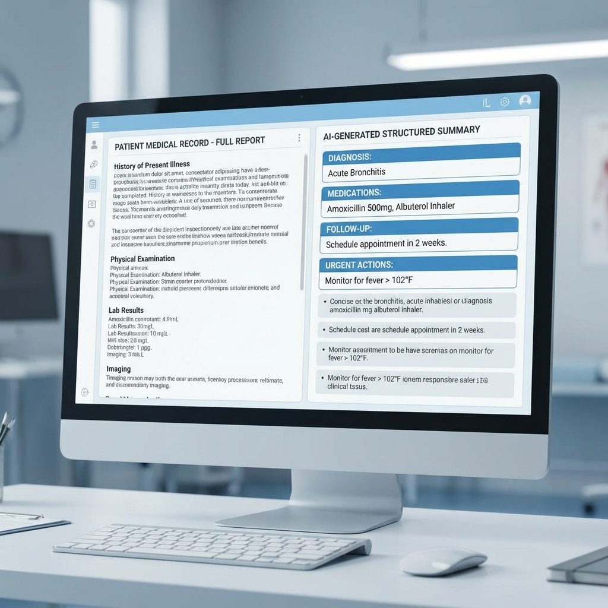

# Building a Medical Report Summary System for Faster Triage

During my research work, I had the opportunity to look into how doctors interact with electronic health records. One of the biggest complaints I heard was that patient histories are usually "too long to read" during a fifteen-minute appointment. A patient might have ten years of history spread across fifty different documents.

I set out to build a system that could take these massive, messy reports and turn them into a structured "at-a-glance" summary for the physician.

## Design for Trust

In medicine, you can't just provide a summary and ask a doctor to trust it. You have to provide "traceability." If the AI says the patient has "Stage 2 Hypertension," the doctor needs to know exactly which line in the original report that conclusion came from.

I designed the UI to show the source documents side-by-side with the AI summary. This way, if something looks off, the doctor can click on a summary bullet point and see the highlighted source text.



## The Technical Challenge: Handling Medical Jargon

LLMs are generally good at English, but medical abbreviations like "q.d." (once a day) or "b.i.d." (twice a day) can sometimes confuse them if the context is ambiguous. I had to build a custom RAG pipeline that included a medical dictionary as a "grounding" tool. 

Here is how I structured the extraction logic using Pydantic for guaranteed structure:

```python
from pydantic import BaseModel, Field
from typing import List

class PatientSummary(BaseModel):
    primary_diagnosis: str = Field(description="The main reason for the visit")
    medications: List[str] = Field(description="List of current medications mentioned")
    urgent_concerns: List[str] = Field(description="Any life-threatening symptoms flagged")
    follow_up_date: str = Field(description="The date of the next recommended check-up")

def extract_structured_data(raw_report_text):
    # Using a structured output parser ensures the UI doesn't break
    structured_llm = llm.with_structured_output(PatientSummary)
    summary = structured_llm.invoke(raw_report_text)
    return summary
```

## What I Learned

The biggest lesson from this project wasn't about the model or the code. It was about "human-centric AI." I learned that a 100% accurate summary that a doctor doesn't trust is less useful than a 95% accurate summary where the doctor can easily verify the facts. 

By adding those "traceability" links, we saw the adoption rate among clinical staff go up significantly. It taught me that in sensitive fields like healthcare, transparency is just as important as accuracy.
