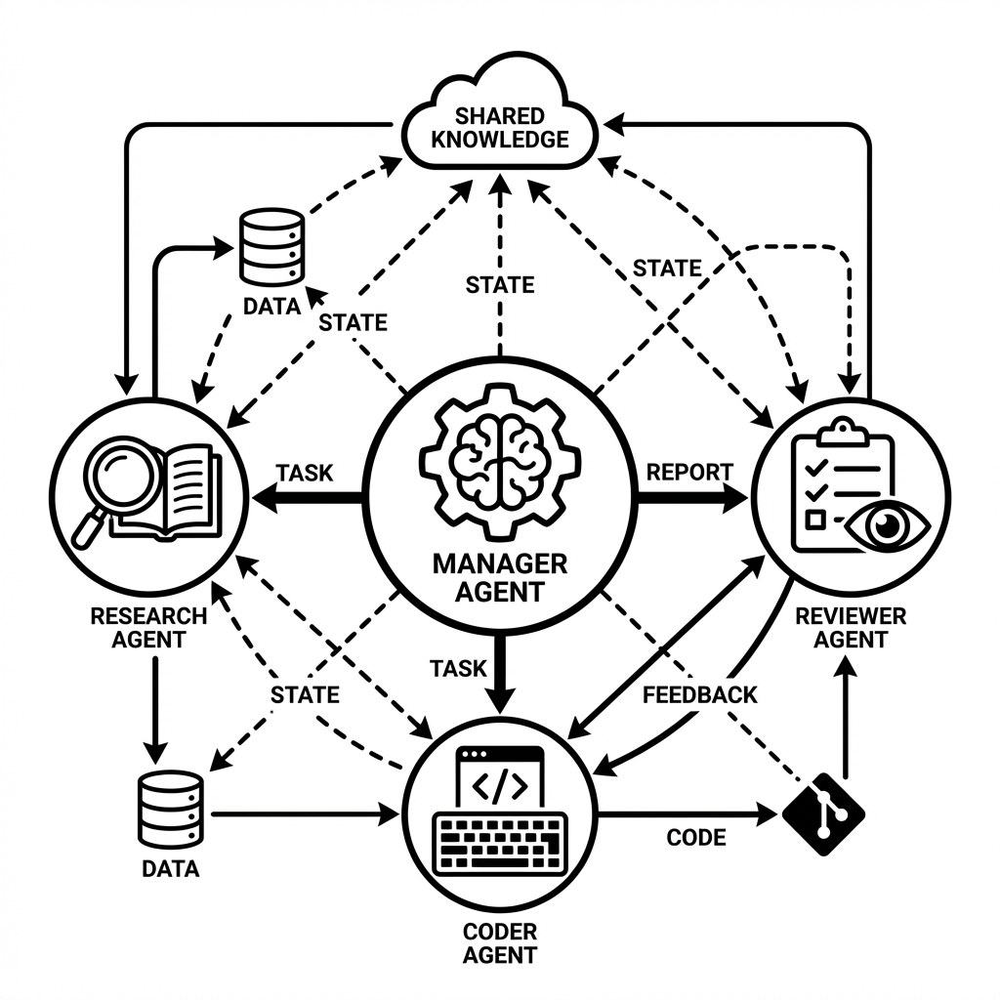

# Orchestrating Chaos: Building Multi-Agent Systems for Complex Workflows

Most developers start with a single chat interface and soon realize that complex tasks like "Write a full-stack feature" or "Perform a deep market analysis" are too big for one prompt window. The context window gets cluttered, the instructions get ignored, and the model starts losing focus as it tries to juggle research, logic, and formatting all at once.

In a recent internal tool I built for a research team, I moved away from a single "Smart Chat" to a **Hierarchical Multi-Agent System**. 

## The Architect Pattern: Delegation over Prompting

The secret to a successful multi-agent system is moving from "How do I prompt this?" to "How do I distribute this work?". I structured my system following the **Architect-Worker Pattern**.



1. **The Orchestrator (Manager):** This agent is the brain of the operation. It receives the high-level goal and uses a "Reasoning and Acting" (ReAct) strategy to break it into a sequence of atomic tasks. It doesn't do any research or coding itself. It only delegates.
2. **The Research Agent:** A tool-heavy agent with access to Serper (Google Search), specialized API connectors, and vector databases. It produces a raw, structured "Fact Sheet."
3. **The Synthesis Agent:** A high-context model (like Claude 3.5 Sonnet) that takes the research data and writes the actual report. It is stripped of all tools to ensure it focuses purely on the writing quality.
4. **The Reviewer Agent:** A separate instance that checks the final output against the original user objective.

## Solving the State Problem: The Global Blackboard

The hardest challenge in multi-agent systems is **State Management**. If Agent A finds a piece of data, how does Agent C know about it without blowing up the token budget? 

I implemented a **Stateful Graph** using a "Global Blackboard" pattern. Instead of every agent seeing the entire conversation history, they only "see" a specialized summary of the current state. We use a shared database (or an in-memory dictionary for smaller runs) to track the progress of each sub-task.

```python
from langgraph.graph import StateGraph, END

# We define a structured state that all agents can read from and write to
class TeamState(TypedDict):
    objective: str
    research_data: str
    draft: str
    feedback: str
    is_ready: bool

def research_step(state: TeamState):
    # This agent only cares about the objective
    raw_data = researcher.invoke(state['objective'])
    return {"research_data": raw_data}

def writing_step(state: TeamState):
    # This agent only cares about the objective AND the research findings
    content = writer.invoke({
        "goal": state['objective'], 
        "data": state['research_data']
    })
    return {"draft": content}

# Orchestrating the flow
workflow = StateGraph(TeamState)
workflow.add_node("researcher", research_step)
workflow.add_node("writer", writing_step)
workflow.add_edge("researcher", "writer")
workflow.set_entry_point("researcher")
```

## Advanced Topic: Managing Agent Conflicts

When you have multiple agents, you eventually run into "Instruction Drift." The Reviewer might ask for a change that contradicts the Coder's original logic. 

To solve this, I implemented a **Primary Directive** for each workflow. Every agent's system prompt begins with a strictly immutable set of rules that act as the "Constitution" of that specific task. This prevents agents from getting into an infinite loop of correcting each other and ensures the project actually moves towards completion.

## The Cost-Performance Sweet Spot

Using multiple agents allows you to be smart about your compute budget. 
- You use **GPT-4o** for the Manager (Decision making).
- You use **GPT-4o-mini** or a fine-tuned **Llama 3** for the Research Agent (High-volume extraction).
- You use **Claude 3.5 Sonnet** for the Writing Agent (Superior prose and logic).

By splitting the work, I reduced operational costs by 60% while simultaneously increasing the detail level of the final reports. If you are still using one big prompt for everything, you are struggling with a tool that wasn't meant to hold that much complexity at once.
