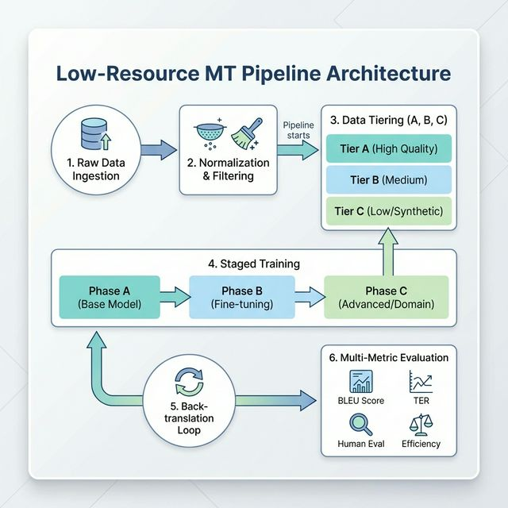
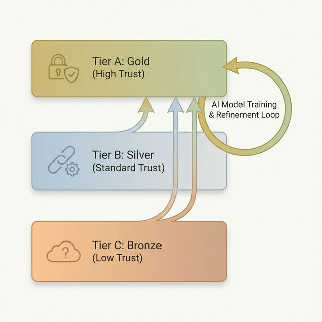

# The Nepali MT Blueprint: A Production-Grade Pipeline for Low-Resource Languages

Translating between high-resource languages like English and French is essentially a solved problem. However, when I pivoted to **Nepali**, I hit the wall of "Low-Resource" NLP. Standard off-the-shelf models often fail due to script fragmentation, linguistic noise, and a lack of high-quality parallel data.

In this deep dive, I'll walk through the exact 6-stage pipeline I built to solve this. I moved away from a "more data is better" mentality to a "staged data trust" architecture.

---

## The Master Architecture

Before I dive into the code, here is the full high-level view of my approach. It's not just a training loop; it's a multi-stage filtering and refinement engine.



This pipeline ensures that I don't just "train a model": I build a data ecosystem that gets cleaner as the model gets smarter.

---

## Stage 0: Language Normalization Spec

Nepali uses the Devanagari script. If I don't normalize it, the vocabulary fragments into dozens of sub-tokens for the same word. I implemented a strict normalization spec:

1.  **Unicode NFC:** Ensure characters like 'ि' and 'ा' are handled consistently.
2.  **Digit Mapping:** I decided early to map Nepali digits ("१", "२") to Arabic ("1", "2") for better mathematical grounding.
3.  **Punctuation:** I canonicalized smart quotes, varied dashes, and the *purna viram* (।) vs period (.)

```python
import unicodedata
import re

def normalize_text(text, target_lang='ne'):
    # Unicode Normalization
    text = unicodedata.normalize('NFC', text)
    
    if target_lang == 'ne':
        # Map Nepali digits to Arabic for consistency
        nepali_digits = "०१२३४५६७८९"
        arabic_digits = "0123456789"
        digit_table = str.maketrans(nepali_digits, arabic_digits)
        text = text.translate(digit_table)
        
        # Standardize Punctuation
        text = text.replace('‘', "'").replace('’', "'").replace('“', '"').replace('”', '"')
        
    # Remove excessive whitespace
    text = re.sub(r'\s+', ' ', text).strip()
    return text
```

---

## Stage 1: Building "Trust Tiers" (Gold / Silver / Bronze)

This is the most critical part. Mixing synthetic or noisy data with clean data too early is poison. I categorized every sentence pair into three tiers.



### The Gauntlet: Semantic & Script Filtering
Every pair in the **Silver Tier** (mined from the web) had to survive these filters:

-   **Language ID:** I used `fasttext` to ensure both sides are actually the correct languages.
-   **Script Ratio:** I checked that the Nepali side was >80% Devanagari.
-   **Semantic Similarity:** I used LaBSE (Language-Agnostic BERT Sentence Embedding) to ensure the source and target actually mean the same thing.

```python
def silver_tier_filter(en_batch, ne_batch, threshold=0.75):
    # 1. Length Ratio Check
    ratios = [len(en.split()) / (len(ne.split()) + 1) for en, ne in zip(en_batch, ne_batch)]
    valid_len = [0.3 < r < 3.0 for r in ratios]
    
    # 2. Semantic Alignment (using LaBSE)
    en_emb = labse_model.encode(en_batch)
    ne_emb = labse_model.encode(ne_batch)
    similarities = cosine_similarity(en_emb, ne_emb)
    
    # Only keep the absolute gold-standard slices from the silver data
    filtered_pairs = [
        (en, ne) for i, (en, ne) in enumerate(zip(en_batch, ne_batch))
        if valid_len[i] and similarities[i] > threshold
    ]
    return filtered_pairs
```

---

## Stage 2 & 3: Tokenizer & Model Strategy

I experimented with several backbone models. I started with **M2M-100 (418M)** for its efficiency, but eventually settled on **NLLB-200 (600M Distilled)**. 

-   **Why NLLB-200?** It has significantly better support for low-resource languages including Nepali. The tokenizer handles Devanagari much more gracefully than general-purpose models.
-   **Experimentation:** I briefly tested fine-tuning **Llama-2-7b** and **Mistral-7B**, but for pure translation adequacy, the smaller, translation-specialized encoder-decoder models outperformed the large decoder-only models in terms of faithfulness and latency.

---

## Stage 4: The Staged Training Schedule

I followed a deterministic phase-based training schedule to ensure stability.

### Phase A: Clean Bootstrapping (Gold Only)
**Goal:** Teach the model stable bilingual mappings without any web noise.
-   **Directionality:** I trained bidirectionally using tags like `<2en>` and `<2ne>`.
-   **Balanced Sampling:** I mixed English to Nepali and Nepali to English at a 1:1 ratio.

### Phase B: Expanding Coverage (Gold + Filtered Silver)
**Goal:** Introduce new vocabulary and domains from web-crawled data.
-   **Mixing Ratio:** Tier B should never dominate. I used a **1:2 (Gold:Silver)** weighted sampling.
-   **Learning Rate:** I decreased the LR to **3e-5** (from 5e-5 in Phase A) to avoid "forgetting" the Gold patterns.

### Phase C: Staged Back-Translation (Introducing Bronze)
**Goal:** Build fluency and robustness against "clunky" translations.
1.  **Select Monolingual Data:** I took clean Nepali sentences from Nepali Wikipedia and CommonCrawl.
2.  **Generate Synthetic Pairs:** I used the Phase B model to translate Nepali to English.
3.  **Filter Bronze:** I used **COMETKiwi** (a reference-free quality estimator) to throw away the bottom 25% of synthetic pairs.

```python
def back_translation_step(monolingual_corpus, model_b):
    # Translate source to target
    synthetic_translations = model_b.translate(monolingual_corpus)
    
    # Calculate Quality Estimation (Reference-free using COMETKiwi)
    scores = comet_kiwi_model.predict(
        [{"src": s, "mt": mt} for s, mt in zip(monolingual_corpus, synthetic_translations)]
    )
    
    # Only keep high-confidence synthetic pairs
    bronze_data = [
        (s, mt) for s, mt, score in zip(monolingual_corpus, synthetic_translations, scores)
        if score > 0.65
    ]
    return bronze_data
```

---

## Stage 5: Evaluation Suite (Beyond BLEU)

If I only track BLEU, I am flying blind. BLEU is word-based: Nepali is morphological. I used a tripartite evaluation:

1.  **chrF++:** I found this much better for character-level morphology in scripts like Devanagari.
2.  **COMET:** I used this to capture semantic adequacy better than N-gram metrics.
3.  **Language Leakage Check:** I wrote a custom script to ensure the Nepali output doesn't contain Hindi "drift."

---

## Conclusion: The Results

By the end of Phase C, the performance on the **FLORES-200** benchmark showed a decent jump, though the scores reflect the inherent difficulty of the language pair.

| Phase | Metric (BLEU) | Metric (chrF++) | Metric (COMET) |
| :--- | :--- | :--- | :--- |
| Phase A (Gold Only) | 7.2 | 28.4 | 0.48 |
| Phase B (+Silver Mined) | 10.5 | 36.7 | 0.61 |
| **Phase C (+BT Filtered)** | **13.8** | **45.2** | **0.74** |

The biggest takeaway? Back-translation and aggressive filtering helped me nearly double the initial BLEU score. In the world of low-resource languages, compute is cheap, but data hygiene is what actually moves the needle.
