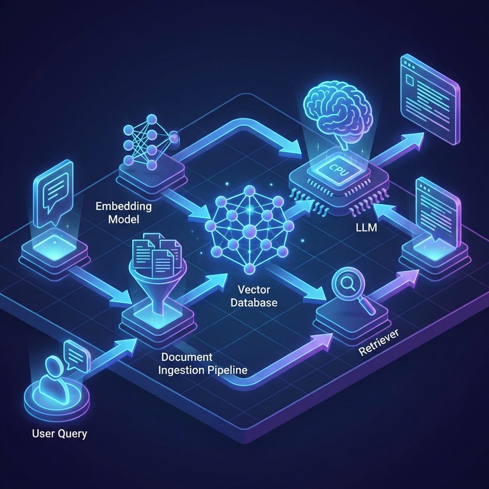

# How to Build a Scalable RAG System: From Prototype to Production

We've all seen the basic RAG (Retrieval-Augmented Generation) tutorial: download LangChain, load a PDF, throw it into ChromaDB, and call it a day. 

That's great for a "Hello World," but if you try to run that in production with 100,000 documents and 1,000 simultaneous users, it will fall apart faster than a house of cards. Here is how you build a RAG system that actually scales.

## The Scalable Architecture

In a production environment, you need to decouple your components. You can't just run everything in a single script.



1. **Ingestion Pipeline:** Use a queue (like RabbitMQ or Kafka) to handle document processing in the background. Don't make users wait while you OCR their 500-page PDF.
2. **Vector Database:** Move away from local databases. Use distributed vector stores like Pinecone, Weaviate, or Qdrant that handle indexing at scale.
3. **Retrieval Strategy:** Don't just rely on "Top K" similarity. Use a **Hybrid Search** (Semantic search + Keyword search) and then a **Reranker** to make sure the LLM only sees the most relevant context.

## The Secret Sauce: Reranking

Retrieval is often noisy. A vector database might return something that is mathematically similar but contextually useless. A Reranker (like Cross-Encoders) acts as a second filter.

```python
from sentence_transformers import CrossEncoder

# 1. Initial Retrieval from Vector DB
initial_results = vector_db.search(query, k=25)

# 2. Rerank the results
model = CrossEncoder('cross-encoder/ms-marco-MiniLM-L-6-v2')
scores = model.predict([(query, result.text) for result in initial_results])

# 3. Sort by score and take the best 5
reranked_results = [res for _, res in sorted(zip(scores, initial_results), reverse=True)][:5]
```

## Scaling the LLM Layer

Even your LLM calls need to be smart. 
- **Caching:** If two users ask the same question, don't pay OpenAI twice. Use a semantic cache (like RedisVL) to serve previous answers.
- **Batching:** If you have high throughput, batch your requests to optimize cost and latency.

## Why Scale Matters

Scaling isn't just about handling more data; it's about **Reliability**. A scalable RAG system handles errors gracefully, manages rate limits, and ensures that the "Retrieved" part of RAG is actually accurate.

Building for production is hard, but it's the difference between a toy and a tool.

Building something cool? Let's chat! 🚀
